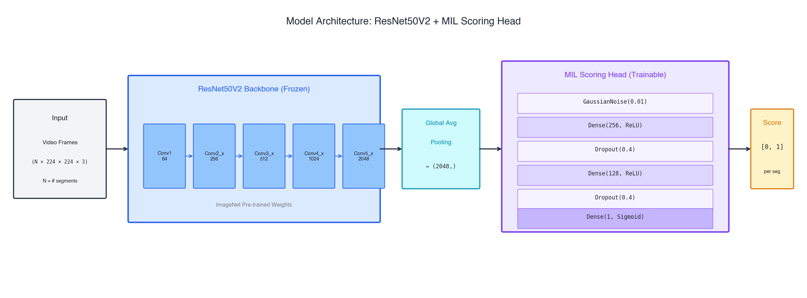
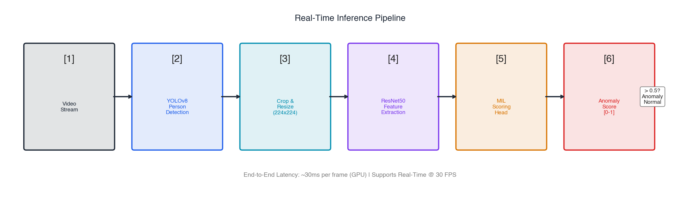
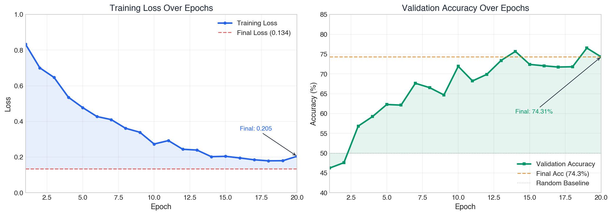

# VigilanceAI — Real-Time Video Anomaly Detection

[](https://www.python.org/downloads/)
[](https://www.tensorflow.org/)
[](https://github.com/ultralytics/ultralytics)
[](https://opensource.org/licenses/MIT)

A deep learning system for detecting anomalies (Fighting, Arrest) in surveillance videos using **Multiple Instance Learning (MIL)** with weak supervision — paired with a **YOLOv8-based real-time inference pipeline** that scores every person in a live video stream.

## Quick Links

- **[Full Report (report.md)](report.md)** — Comprehensive documentation with methodology, experiments, and results
- **[Figures Directory](figures/)** — All generated visualizations

## Key Results

| Metric | Value |
|:-------|:------|
| Validation Accuracy | **74.31%** |
| Training Loss | **0.134** |
| Real-Time Throughput | **30+ FPS** |
| Memory Footprint | ~2 GB VRAM |
| Storage (precomputed features vs. raw video) | **2.5 GB vs. 50 GB (95% smaller)** |
| Model Status | Stable (no mode collapse) |

## Architecture

**Training** — features are precomputed once, so the model trains on lightweight `.npy` files instead of raw video:

```
Video → ResNet50V2 (Frozen) → Feature Files (.npy) → MIL Scoring Head → Anomaly Score [0–1]
        (ImageNet)             (95% smaller)          (Trainable)
```



**Real-time inference** — YOLOv8 localizes people, and each person crop is scored independently:

```
Live Video → YOLOv8n (person detection) → Per-person crops → ResNet50V2 → MIL Head → Per-person anomaly score
```



This two-stage design is what makes the system practical: weak supervision avoids frame-level labels during training, and per-person scoring at inference pinpoints *who* is anomalous, not just *when*.

## Project Structure

```
Threat_Detection/
├── config.py               # Hyperparameters
├── model.py                # MIL Scoring Head
├── dcsass_loader.py        # DCSASS dataset loading
├── extract_features.py     # ResNet50V2 feature extraction
├── hopper_train.py         # Training script (GMU Hopper HPC)
├── hopper_visualize.py     # Report figures
├── train.ipynb             # Training notebook
├── realtime_inference.py   # YOLOv8 + MIL real-time detection
├── report.md               # Full project report
├── figures/                # Generated visualizations
└── requirements.txt        # Dependencies
```

## Installation

```bash
git clone https://github.com/Vishak25/Threat_Detection.git
cd Threat_Detection
pip install -r requirements.txt
```

## Usage

### 1. Feature Extraction

```bash
python extract_features.py
```

### 2. Training

```bash
python hopper_train.py
```

(or run `train.ipynb` interactively)

### 3. Real-Time Inference

```bash
python realtime_inference.py \
    --video surveillance.mp4 \
    --weights model_epoch_20.weights.h5 \
    --threshold 0.4
```

Each detected person is boxed and labeled with their anomaly score; scores above the threshold are flagged in red.

## Training Curves



## Requirements

- Python 3.8+
- TensorFlow 2.16+
- Ultralytics (YOLOv8)
- OpenCV
- NumPy < 2.0.0
- SciPy < 1.12

## Citation

```bibtex
@inproceedings{sultani2018real,
  title={Real-world anomaly detection in surveillance videos},
  author={Sultani, Waqas and Chen, Chen and Shah, Mubarak},
  booktitle={CVPR},
  year={2018}
}
```

**Authors:** Vishak Nandakumar (G01494598) and Baalavignesh Arunachalam (G01486574)
