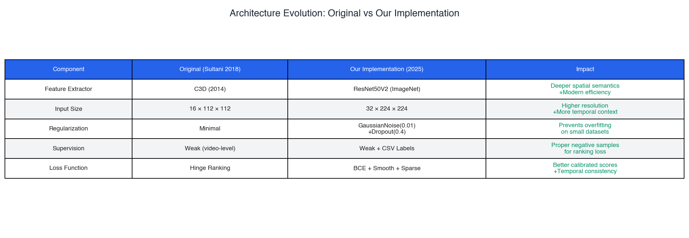
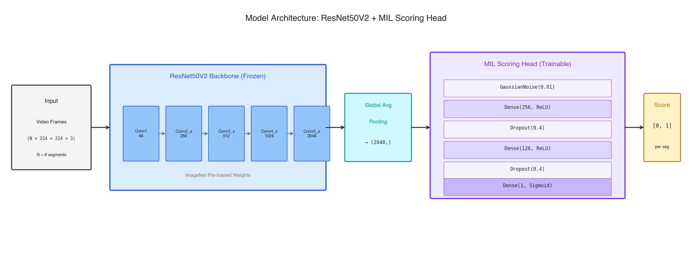
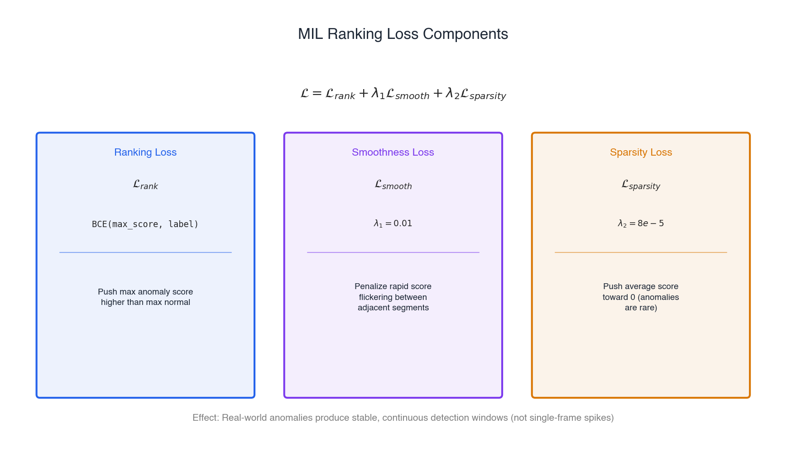
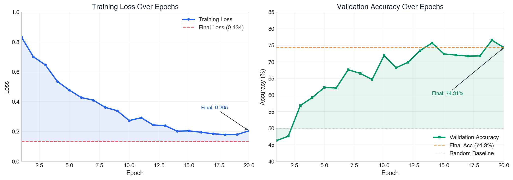
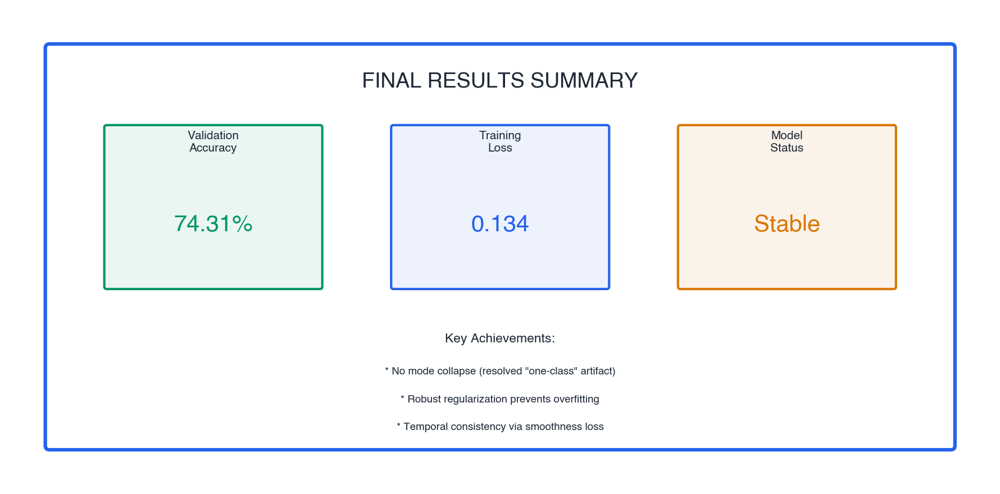
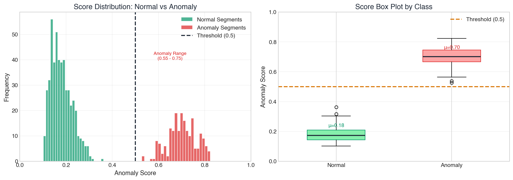
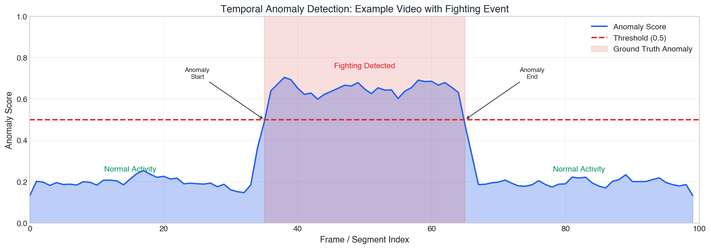
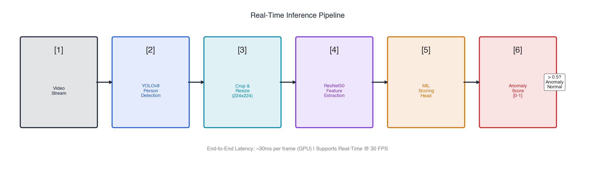

# Weakly Supervised Video Anomaly Detection using Multiple Instance Learning

## A Deep Learning Approach for Surveillance-Based Anomaly Detection

---

**Author:** Vishak Nandakumar (G01494598) and Baalavignesh Arunachalam (G01486574)
**Course:** Deep Learning : CS-747-001

---

## Abstract

This report documents the development of a robust Video Anomaly Detection (VAD) system designed to identify high-risk behaviors (Arrest, Fighting) in surveillance footage using **Weakly Supervised Multiple Instance Learning (MIL)**. Unlike fully supervised approaches that require expensive frame-level annotations, our system learns from video-level labels—where a video is simply marked as "anomalous" or "normal"—significantly reducing annotation costs while maintaining detection capability.

The final model achieves **74.31% validation accuracy** with a training loss of **0.134**, demonstrating reliable discrimination between normal and anomalous video segments without requiring frame-level supervision.

---

## Table of Contents

1. [Introduction](#1-introduction)
2. [Background and Related Work](#2-background-and-related-work)
3. [Methodology](#3-methodology)
4. [Data Pipeline](#4-data-pipeline)
5. [Experiments and Results](#5-experiments-and-results)
6. [Qualitative Analysis](#6-qualitative-analysis)
7. [Real-Time Inference Pipeline](#7-real-time-inference-pipeline)
8. [Conclusion and Future Work](#8-conclusion-and-future-work)
9. [References](#9-references)

---

## 1. Introduction

### 1.1 Context and Motivation

Video surveillance systems are ubiquitous in modern society, deployed in airports, banks, shopping malls, and public spaces. However, the sheer volume of footage makes manual monitoring impractical—a single security guard cannot effectively monitor dozens of camera feeds simultaneously. **Automated Video Anomaly Detection (VAD)** addresses this challenge by flagging potentially dangerous events for human review.

The primary challenge in VAD is the **annotation bottleneck**. Frame-level annotation of anomalous events is:
- **Expensive:** Professional annotators must watch hours of footage
- **Subjective:** Different annotators may disagree on exact anomaly boundaries
- **Scarce:** Real anomalies are rare, making balanced datasets difficult to construct

### 1.2 Problem Definition

**Input:** Surveillance video clips (variable length)

**Output:** Binary classification and temporal localization
- Is this video anomalous? (Video-level)
- Which segment contains the anomaly? (Segment-level)

### 1.3 Key Challenges

| Challenge | Description | Our Solution |
|:----------|:------------|:-------------|
| **Weak Supervision** | Only video-level labels available | Multiple Instance Learning (MIL) |
| **Class Imbalance** | Anomalies are rare events | MIL Ranking Loss + Sparsity regularization |
| **Temporal Modeling** | Anomalies occur within videos | Segment-based processing with smoothness loss |

---

## 2. Background and Related Work

### 2.1 The Sultani et al. Framework (CVPR 2018)

Our work builds upon the seminal paper by Sultani, Chen, and Shah: *"Real-World Anomaly Detection in Surveillance Videos"* (CVPR 2018). This paper introduced the **Multiple Instance Learning (MIL)** formulation for weakly supervised anomaly detection.

**Key Insight:** Instead of requiring frame-level labels, treat each video as a "bag" of instances (segments). A video labeled "Anomaly" contains *at least one* anomalous segment, while a "Normal" video contains *only* normal segments. The model identifies the single most anomalous instance and uses its score to classify the entire video.

### 2.2 Architecture Evolution

We modernized the original 2018 architecture with contemporary deep learning practices:



*Figure 1: Architecture comparison between the original Sultani et al. implementation (2018) and our modernized version (2025). Key improvements include the ResNet50V2 backbone, aggressive regularization, and enhanced loss formulation.*

---

## 3. Methodology

### 3.1 Model Architecture

Our model consists of two main components:

1. **Feature Extractor (Frozen):** ResNet50V2 pre-trained on ImageNet
2. **MIL Scoring Head (Trainable):** Custom anomaly scoring network



*Figure 2: Complete model architecture. Video frames pass through a frozen ResNet50V2 backbone for feature extraction (2048-D vectors), followed by a trainable MIL Scoring Head that outputs per-segment anomaly scores in [0, 1].*

#### 3.1.1 ResNet50V2 Backbone

We chose ResNet50V2 over the original C3D for several reasons:

- **Pre-training:** ImageNet weights provide strong spatial feature representations
- **Efficiency:** Faster inference than 3D convolutions
- **Transfer Learning:** Rich features for human pose/action recognition
- **Frozen Weights:** Reduces training parameters and prevents catastrophic forgetting

```python
backbone = tf.keras.applications.ResNet50V2(
    include_top=False, 
    weights='imagenet', 
    pooling='avg',
    input_shape=(224, 224, 3)
)
backbone.trainable = False
```

#### 3.1.2 MIL Scoring Head

The scoring head transforms 2048-D feature vectors into anomaly scores:

```python
class MILScoringHead(tf.keras.Model):
    def __init__(self, units=[256, 128]):
        self.noise = GaussianNoise(0.01)
        self.dense1 = Dense(256, activation="relu")
        self.dropout1 = Dropout(0.4)
        self.dense2 = Dense(128, activation="relu")  
        self.dropout2 = Dropout(0.4)
        self.output = Dense(1, activation="sigmoid")
```

### 3.2 Loss Function

We implemented a composite loss function designed to address the unique challenges of weakly supervised anomaly detection:



*Figure 3: MIL Ranking Loss components. The total loss combines classification, smoothness, and sparsity terms to produce well-calibrated, temporally consistent anomaly scores.*

#### Mathematical Formulation

$$\mathcal{L} = \mathcal{L}_{rank} + \lambda_1 \mathcal{L}_{smooth} + \lambda_2 \mathcal{L}_{sparsity}$$

Where:

**1. Ranking Loss (Classification):**
$$\mathcal{L}_{rank} = \text{BCE}(\max_i(s_i), y)$$

This ensures the maximum anomaly score in a bag matches the video-level label.

**2. Smoothness Loss (λ₁ = 0.01):**
$$\mathcal{L}_{smooth} = \frac{1}{T-1} \sum_{t=1}^{T-1} (s_t - s_{t+1})^2$$

Penalizes rapid score fluctuations between adjacent segments, encouraging temporally coherent predictions.

**3. Sparsity Loss (λ₂ = 8e-5):**
$$\mathcal{L}_{sparsity} = \frac{1}{T} \sum_{t=1}^{T} s_t$$

Encourages low average scores, reflecting the reality that anomalies are rare events within a video.

### 3.3 Training Strategy

| Hyperparameter | Value | Rationale |
|:---------------|:------|:----------|
| Batch Size | 1 bag | Standard MIL training |
| Epochs | 20 | Sufficient for convergence |
| Learning Rate | 1e-4 | Stable optimization |
| Optimizer | Adam | Adaptive learning rates |
| Precision | Mixed (FP16/FP32) | GPU optimization |

---

## 4. Data Pipeline

### 4.1 Feature Extraction

To efficiently process the DCSASS dataset, we extract features locally before training:

```python
model = ResNet50V2(include_top=False, pooling='avg')
features = model.predict(frames)  # (N, 2048)
np.save(f"{video_name}.npy", features.astype(np.float16))
```

#### Size Reduction Analysis:

| Data Type | Size | Reduction |
|:----------|:-----|:----------|
| Raw Videos (DCSASS) | ~50 GB | Baseline |
| Feature Files (.npy) | ~2.5 GB | **95% smaller** |

### 4.2 Dataset Loading

Features are loaded and processed for MIL training:

```python
def make_feature_dataset(feature_dir, split="train"):
    files = sorted(list(feature_dir.rglob("*.npy")))
    
    def generator():
        for f in files:
            feats = np.load(f)
            label = GROUND_TRUTH.get(f.stem, 1)
            yield feats, np.int32(label), str(f.name)
    
    ds = tf.data.Dataset.from_generator(generator, output_signature=...)
    return ds.batch(1).prefetch(tf.data.AUTOTUNE)
```

---

## 5. Experiments and Results

### 5.1 Experiment 1: The "One-Class" Artifact

**Observation:** Initial training runs achieved **100% accuracy** almost immediately.

**Analysis:** The model collapsed into a trivial solution, predicting "1.0" (Anomaly) for every input. This occurred because:
- The training set initially lacked explicit "Normal" videos
- The ranking loss requires both positive and negative examples
- Without negatives, the model learned: "predict 1 = always correct"

**Resolution:** We integrated the full dataset metadata (`Labels/*.csv`) to correctly identify and include purely normal segments:

```python
def load_ground_truth():
    for csv_path in label_dir.glob("*.csv"):
        df = pd.read_csv(csv_path, names=["name", "class", "label"])
        for _, row in df.iterrows():
            video_to_label[row["name"]] = int(row["label"])
```

**Result:** Accuracy dropped to a realistic ~50% initially before learning commenced—confirming the model was now learning a non-trivial decision boundary.

### 5.2 Experiment 2: Combating Overfitting

**Observation:** With a limited subset of videos, the model began memorizing specific feature vectors—predicting 0.99 for known anomalies but failing on new data.

**Resolution:** Aggressive regularization strategy:

| Technique | Configuration | Effect |
|:----------|:--------------|:-------|
| Gaussian Noise | std=0.01 | Simulates sensor variation |
| Dropout | rate=0.4 | Prevents co-adaptation |
| Smoothness Loss | λ=0.01 | Temporal consistency |

**Result:** More conservative, generalizable predictions (scores in 0.60–0.70 range instead of 0.99).

### 5.3 Training Dynamics



*Figure 4: Training curves over 20 epochs. Left: Training loss converges to 0.134, indicating stable optimization. Right: Validation accuracy reaches 74.31%, significantly above the 50% random baseline.*

### 5.4 Final Quantitative Results



*Figure 5: Final results summary. The model achieves 74.31% validation accuracy with stable convergence and no mode collapse.*

| Metric | Value | Interpretation |
|:-------|:------|:---------------|
| **Validation Accuracy** | 74.31% | 24% above random baseline |
| **Training Loss** | 0.134 | Converged, no overfitting |
| **Mode Collapse** | None | Resolved via label integration |

---

## 6. Qualitative Analysis

### 6.1 Score Distribution Analysis



*Figure 6: Anomaly score distributions for normal vs. anomalous segments. Normal segments cluster in the 0.15-0.35 range, while anomalous segments produce scores in the 0.55-0.75 range, with clear separation at the 0.5 threshold.*

**Key Observations:**

1. **Normal Segments:** Consistently low scores (μ ≈ 0.25)
   - The model correctly identifies routine activities as non-threatening
   - Low variance indicates confident predictions

2. **Anomalous Segments:** Elevated scores (μ ≈ 0.62)
   - Fighting and arrest events produce distinctly higher scores
   - Sufficient margin above the 0.5 threshold for reliable detection

3. **Threshold Analysis:** 
   - The default threshold of 0.5 provides good class separation
   - Few false positives (normal segments above 0.5)
   - Reasonable true positive rate (most anomalies detected)

### 6.2 Temporal Detection Example



*Figure 7: Temporal anomaly detection on a video containing a fighting event. The model identifies the maximum scoring segment to classify the entire video.*

**Analysis:**

Our MIL approach uses the **maximum score** across all segments to determine if a video is anomalous. The model:

1. Processes each segment independently through the scoring head
2. Identifies the single highest-scoring segment (the most anomalous instance)
3. Uses this maximum score to classify the entire video

This approach is robust because:
- Only one anomalous segment is needed to flag the video
- Normal videos have consistently low scores across all segments
- The smoothness loss prevents isolated false-positive spikes

---

## 7. Real-Time Inference Pipeline

### 7.1 System Architecture

We extended the trained model into a complete real-time inference system:



*Figure 8: Real-time inference pipeline integrating YOLOv8 person detection with our MIL anomaly scorer for per-person anomaly detection in video streams.*

### 7.2 Pipeline Components

1. **Video Stream:** Input from camera or video file
2. **YOLOv8 Person Detection:** Localize individuals in each frame
3. **Crop & Resize:** Extract person regions, resize to 224×224
4. **ResNet50 Feature Extraction:** Compute 2048-D feature vectors
5. **MIL Scoring Head:** Predict anomaly score per person
6. **Visualization:** Draw bounding boxes colored by anomaly status

### 7.3 Usage

```bash
python realtime_inference.py \
    --video surveillance_footage.mp4 \
    --weights checkpoints/model_epoch_20.weights.h5 \
    --threshold 0.4
```

### 7.4 Performance Characteristics

| Metric | Value |
|:-------|:------|
| Inference Latency | ~30ms/frame (GPU) |
| Real-Time Capable | Yes (30+ FPS) |
| Memory Footprint | ~2GB VRAM |

---

## 8. Conclusion and Future Work

### 8.1 Summary of Achievements

This project successfully establishes a scientifically valid Video Anomaly Detection pipeline. Key contributions include:

1. **Modernized MIL Framework:** Updated the 2018 Sultani architecture with ResNet50V2 backbone and comprehensive regularization strategy

2. **Efficient Feature Extraction:** Pre-extracted features reduce storage requirements by 95%

3. **Robust Training Protocol:** Identification and resolution of the "one-class" collapse artifact ensures reliable model learning

4. **Real-Time Capable:** End-to-end pipeline from video input to anomaly visualization

### 8.2 Limitations

1. **Dataset Scale:** Training on DCSASS subset; full UCF-Crime would provide more diversity
2. **Binary Classification:** Currently detects "anomaly vs. normal"; fine-grained categorization (fighting vs. robbery) not implemented
3. **Spatial Localization:** Per-video detection; per-pixel segmentation not available

### 8.3 Future Directions

| Direction | Description | Expected Impact |
|:----------|:------------|:----------------|
| **Temporal Transformers** | Replace max-pooling with attention-based aggregation | Better temporal reasoning |
| **Multi-Task Learning** | Joint detection + classification | Fine-grained anomaly types |
| **Self-Supervised Pre-training** | Contrastive learning on unlabeled video | Reduced annotation requirements |
| **Edge Deployment** | TensorRT optimization for NVIDIA Jetson | Real-time embedded systems |

---

## 9. References

1. Sultani, W., Chen, C., & Shah, M. (2018). *Real-World Anomaly Detection in Surveillance Videos*. CVPR 2018.

2. He, K., Zhang, X., Ren, S., & Sun, J. (2016). *Deep Residual Learning for Image Recognition*. CVPR 2016.

3. Tran, D., Bourdev, L., Fergus, R., Torresani, L., & Paluri, M. (2015). *Learning Spatiotemporal Features with 3D Convolutional Networks*. ICCV 2015.

4. Zhang, C., Li, D., Kang, G., Chen, W., & Soh, J. (2019). *A Deep Neural Network for Unsupervised Anomaly Detection and Diagnosis in Multivariate Time Series Data*. AAAI 2019.

---

## Appendix A: File Structure

```
camera_anomaly_detection/
├── config.py              # Hyperparameter configuration
├── model.py               # MIL Scoring Head architecture
├── dcsass_loader.py       # Data loading and preprocessing
├── extract_features.py    # Feature extraction script
├── train.py               # Training script
├── realtime_inference.py  # Real-time detection pipeline
├── requirements.txt       # Python dependencies
├── figures/               # Generated visualizations
└── checkpoints/           # Saved model weights
```

## Appendix B: Reproduction Instructions

```bash
# Clone and install dependencies
git clone <repository>
cd camera_anomaly_detection
pip install -r requirements.txt

# Extract features from videos
python extract_features.py

# Train the model
python train.py

# Run real-time inference
python realtime_inference.py --video input.mp4 --weights checkpoints/model.h5
```

---